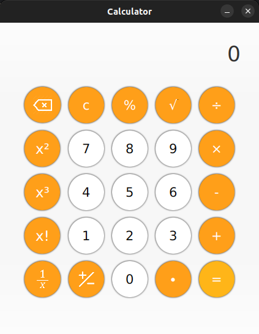

# Calculator
A simple Calculator developed in Java using JavaFX -- (JDK 11)



## Features

* Addition
* Subtraction
* Multiplication
* Division
* Square Root
* Exponents
* Factorial
* Percent
* Sign Inversion
* Division 1 / x

## How to use it

### Running the Application
```shell
mvn clean compile javafx:jlink

```

### Building the Application
```shell
mvn clean compile javafx:jlink
./target/Calculator/bin/CalculatorLauncher
```
